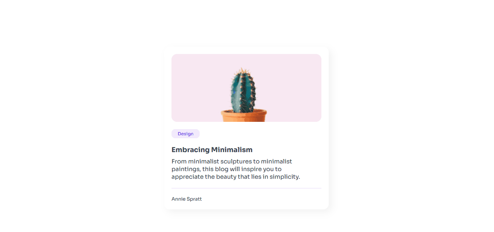
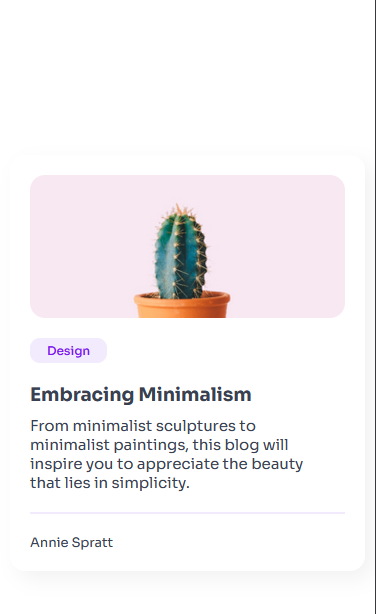

<h1 align="center">Minimal Blog Card</h1>

  Projeto da <a href="https://devchallenges.io/editor/solution/39336">https://devchallenges.io/</a>.

### 🖥 Desktop

  

### 📱 Mobile

  

 

## 🚀 Tecnologias

- HTML e CSS(com responsividade)

## 💻 Projeto

Projeto para entrar nos conceitos de Front-End e desenvolvimento web.